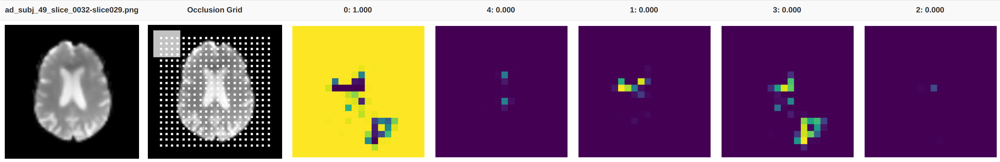

To evaluate the robustness of the CNN trained on the MRI data, I used the [Picasso CNN Visualizer](https://github.com/merantix/picasso) to perform [partial occlusion](https://arxiv.org/pdf/1311.2901.pdf).

This gives us the added benefit of determining which areas of the brain the CNN deems essential for classifying Alzheimer's brains.

This folder lists a few scripts used for partial occlusion through Picasso.

Below is a sample output from Picasso on a 2d slice.

